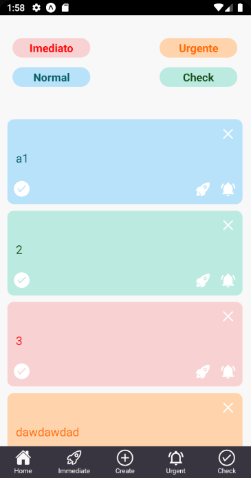

<div align="center">
  
</div>

<p align="center">
Esse projeto <strong>IdNotepad</strong>, é um bloco para anotar algumas tarefas ou ideias, e colocar prioridades na execução com as cores.
</p>

**Para iniciar o projeto**

```bash
 yarn global add expo-cli
 
```

```bash
yarn start

```

```bash
 yarn android
 
```

Para rodar o [backend do app](https://github.com/Thales-Eduardo/Backend-IdNotepad) com o [docker](https://docs.docker.com/get-docker/).

```bash
docker-compose up -d

```

```bash
adb reverse tcp:3333 tcp:3333

```

---

<div align="center">
  

</div>

